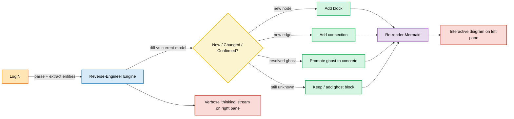
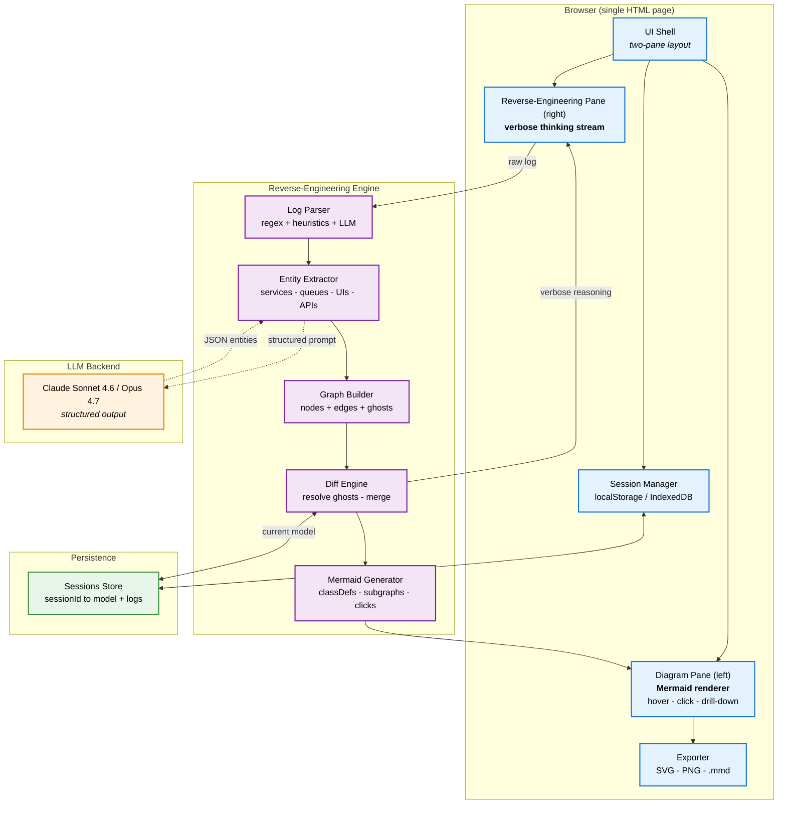
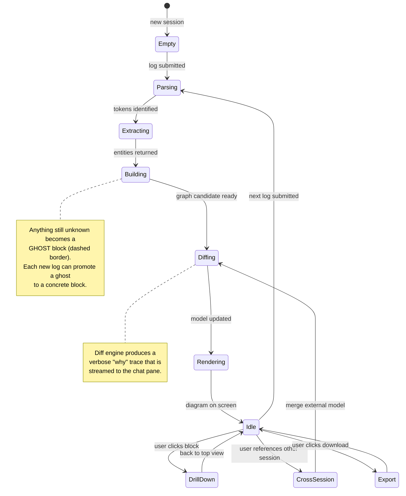
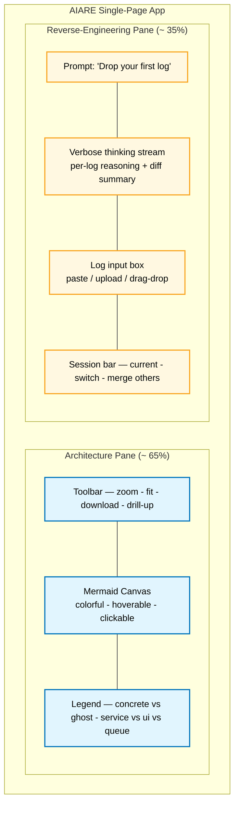
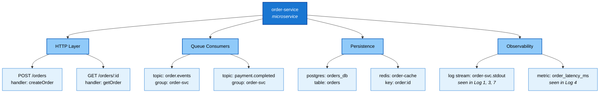
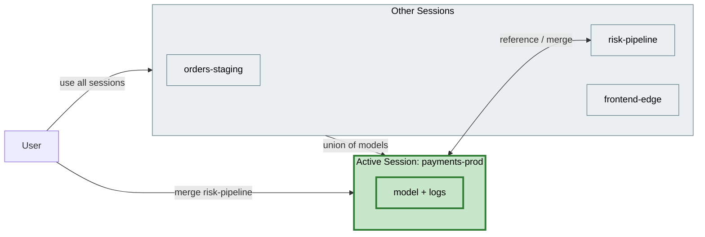
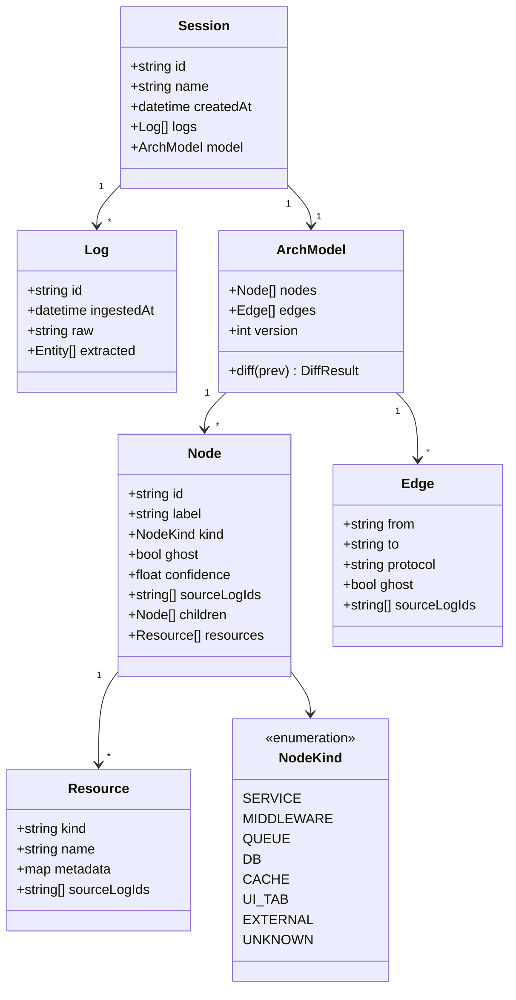
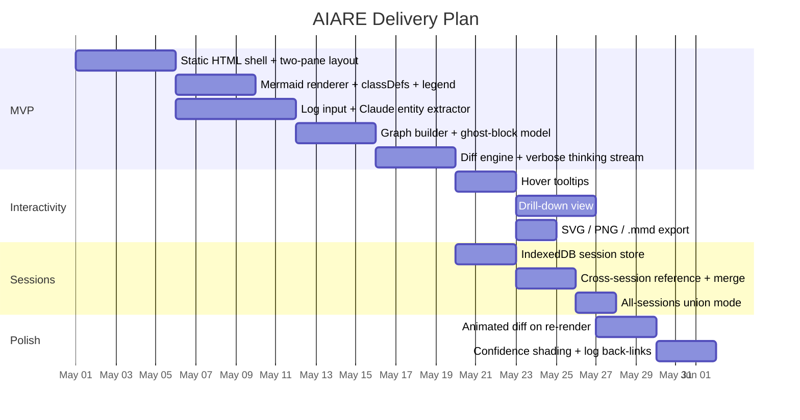

# AIARE — AI Architecture Reverse Engineer

> **Drop in logs. Watch an architecture draw itself.**
>
> AIARE is a single-page web app that ingests pipeline / platform logs **incrementally** and reverse-engineers the underlying **backend ↔ middleware ↔ frontend** architecture as a verbose, colorful, interactive Mermaid diagram. Every new log fills in more of the picture.

---

## Table of Contents

1. [What is AIARE?](#what-is-aiare)
2. [Core Concept](#core-concept)
3. [Feature Matrix](#feature-matrix)
4. [High-Level System Architecture](#high-level-system-architecture)
5. [User Flow](#user-flow)
6. [Incremental Reverse-Engineering Loop](#incremental-reverse-engineering-loop)
7. [UI Layout](#ui-layout)
8. [Drill-Down Model](#drill-down-model)
9. [Session Model](#session-model)
10. [Data Model](#data-model)
11. [Tech Stack](#tech-stack)
12. [Getting Started](#getting-started)
13. [Roadmap](#roadmap)

---

## What is AIARE?

AIARE = **A**I **A**rchitecture **R**everse **E**ngineer.

You paste a log. AIARE reads it, figures out which services, queues, middlewares, UIs and APIs *must* exist for that log line to have happened, and renders that as a Mermaid diagram. Anything it cannot yet infer is shown as a **ghost block** (dashed, greyed out). Add another log → ghosts get resolved, new services appear, edges fill in.

> **Example**
>
> - **Log 1** → infers *5 microservices*, *1 middleware*, *3 UI tabs*, plus several **unknown** producers/consumers of API signals.
> - **Log 2** → resolves a couple of those unknowns, exposes a new queue, leaves the rest dashed.
> - **Log N** → the architecture converges.

---

## Core Concept



---

## Feature Matrix

| # | Feature                                                                 | Status   |
|---|-------------------------------------------------------------------------|----------|
| 1 | Verbose, colorful Mermaid diagrams (classDefs, grouping, subgraphs)     | spec     |
| 2 | Hover tooltips on every block with summary, source-log refs, confidence | spec     |
| 3 | Right-side "thinking" chat pane that prompts for the first log          | spec     |
| 4 | Incremental upgrades — each log resolves ghost blocks                   | spec     |
| 5 | Download diagram (SVG / PNG / .mmd)                                     | spec     |
| 6 | Drill-down: click a block → see inner components + actual resources     | spec     |
| 7 | One session = one architecture; cross-session referencing on demand     | spec     |
| 8 | All-sessions mode (merge every prior session into the model)            | spec     |

---

## High-Level System Architecture



---

## User Flow

```mermaid
sequenceDiagram
    autonumber
    actor U as User
    participant C as Chat Pane (right)
    participant E as RE Engine
    participant L as LLM
    participant D as Diagram Pane (left)
    participant S as Session Store

    U->>C: opens AIARE
    C-->>U: "Paste your first log to begin."
    U->>C: pastes Log 1
    C->>E: submit(log1, sessionId)
    E->>L: extract entities + relations (structured)
    L-->>E: services, middlewares, uis, edges, unknowns
    E->>E: build initial graph (concrete + ghost blocks)
    E-->>C: stream "I see 5 services, 1 mw, 3 UI tabs, N unknowns..."
    E->>D: render Mermaid v1
    E->>S: persist model + log1

    U->>C: pastes Log 2
    C->>E: submit(log2, sessionId)
    E->>L: extract delta
    L-->>E: new entities, resolved ghosts, still-unknown
    E->>E: diff + merge into model
    E-->>C: stream "Resolved auth-mw to concrete; new queue order.events found; 2 unknowns remain"
    E->>D: re-render Mermaid v2 (animated diff)
    E->>S: persist model + log2

    U->>D: hovers a block
    D-->>U: tooltip {role, source logs, confidence}
    U->>D: clicks a block
    D->>D: drill-down to inner components + actual resources

    U->>C: "use session 'payments-2025' too"
    C->>S: fetch other session model
    S-->>E: merge contexts
    E->>D: re-render with combined model
```

---

## Incremental Reverse-Engineering Loop



---

## UI Layout



---

## Drill-Down Model

Click any block to expand its internals. Each level keeps the same hover/click semantics, and bottoms out at the **actual resource names** found in the logs.



> Each leaf carries back-references to the **exact log lines** that produced it — click → opens that log in the chat pane, highlighted.

---

## Session Model

One session = one architecture. Sessions are independent by default but can be **referenced** or **fully merged** on request.



---

## Data Model



---

## Tech Stack

| Layer            | Choice                                                          | Why                                                         |
|------------------|-----------------------------------------------------------------|-------------------------------------------------------------|
| Shell            | Single static HTML + vanilla JS / TS modules                    | Matches the "one HTML page" brief; zero deploy friction.    |
| Diagram          | Mermaid.js (`flowchart`, `sequenceDiagram`, `classDiagram`)     | Verbose, colorful via `classDef`, natively supports clicks. |
| Interactivity    | Mermaid `click` callbacks + custom tooltip layer                | Hover summaries + drill-down without a heavy framework.     |
| Reasoning        | Claude Sonnet 4.6 for streaming, Opus 4.7 for hard logs         | Structured JSON output for entities + edges.                |
| Streaming UI     | Server-sent style streaming into the right pane                 | Verbose "thinking" feel.                                    |
| Persistence      | IndexedDB (sessions) + localStorage (prefs)                     | Fully client-side, portable.                                |
| Export           | `mermaid.render()` → SVG; canvg → PNG; raw `.mmd` text          | Three download formats out of the box.                      |

---

## Getting Started

```bash
# clone
git clone https://github.com/Archit3115/AIARE.git
cd AIARE

# (no build step yet — open the HTML directly)
open index.html
```

Workflow once the page is up:

1. The right pane prompts: **"Paste your first log to begin."**
2. Paste a log → watch the diagram appear on the left, with ghost blocks for anything unresolved.
3. Paste more logs → ghosts get promoted, new blocks appear, the picture sharpens.
4. **Hover** any block for a summary; **click** to drill down to actual resources.
5. Use the toolbar to **download** the diagram as SVG / PNG / `.mmd`.
6. Reference another session by name in the chat pane to merge its model in.

---

## Roadmap



---

## License

MIT — see `LICENSE` (to be added).

---

> **AIARE** turns logs into living architecture diagrams, one paste at a time.
